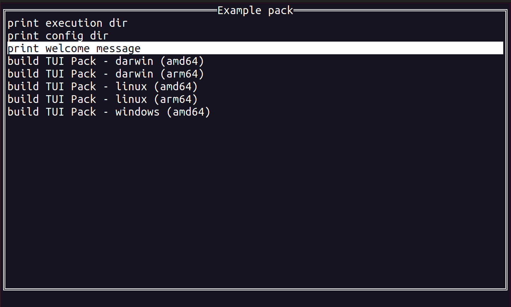

# TUI commands pack

A tool for organizing frequently used commands within the terminal user interface.

You can describe a set of commands in a single TOML file and easily access them from the terminal interface.

Follow the example from the [examples catalog](./example) or watch the [GIF record](./example/tuiPackExample.gif "Example")



## Usage

```bash
# ask for help
tuiPack --help
```

### Terminal user interface

```bash
# start the terminal user interface with commands from the specified config
tuiPack --config ./example/commandPack.toml
```

#### Hotkeys

`/` - to enter filtering mode

### Execute a command by an alias

```bash
# show available commands
tuiPack --config ./example/commandPack.toml --aliases
# execute "print_message_from_env" command
tuiPack --config ./example/commandPack.toml --script print_message_from_env
```

## TOML config

##### additional environment variables

`COMMAND_PACK_DIR` - absolute path of the config directory  
`COMMAND_PACK_EXECUTION_DIR` - absolute path of the executuon directory  

##### example

```toml
name = "Command pack name"

[[commands]]
name = "command displayed name"
type = "script"
script = 'echo "$ENV_1" "$ENV_2"'
alias = "command_alias_for_terminal"
description = "description of the command"

[commands.env]
ENV_2 = "ENV_2_VALUE"

[env]
ENV_1 = "ENV_1_VALUE"
```
